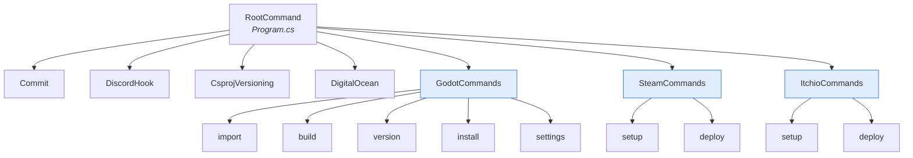

# Architecture

This document explains how MG-CLI is structured internally: the entry point, the command pattern every feature follows, the shared utility layer, and the cross-cutting conventions (version handling, process execution, logging, and platform abstraction) that hold it together.

## High-level shape

MG-CLI is a small single-project .NET application. There is no plugin system and no dependency-injection container — the design is deliberately flat and explicit:

The `RootCommand` in `Program.cs` is the composition root. Top-level commands hang directly off it; the `godot`, `steam`, and `itchio` verbs are *container* commands whose only job is to hold children:



Underneath the commands sits a shared, static helper layer in `Utils/` (plus the top-level `DigitalOcean/` folder for that command):

| File | Responsibility |
|---|---|
| `Log.cs` | Colored console output + optional file logging |
| `CliWrapExtensions.cs` | Standard stdout/stderr piping for CliWrap |
| `Web.cs` | HTTP download with progress bar |
| `Zip.cs` | Unzip with progress bar |
| `FileEx.cs` | UTF-8 (no BOM) writes, chmod helper |
| `DirectoryUtil.cs` | Delete/recreate directory helpers |
| `GodotUtils.cs` | Locate the `project.godot` settings file |
| `StringExtensions.cs` | `ToSnakeCase()` |

## The entry point

[`Program.cs`](https://github.com/Mainframe-Games/mg-ci/blob/main/MG-CLI/Program.cs) is the composition root. Using top-level statements, it constructs a [`System.CommandLine`](https://learn.microsoft.com/dotnet/standard/commandline/) `RootCommand`, registers every top-level command onto it, and invokes the parser:

```csharp
var rootCommand = new RootCommand("Mainframe CI Tool")
{
    new Commit(),
    new DiscordHook(),

    new GodotCommands(),
    new ItchioCommands(),
    new SteamCommands(),

    new CsprojVersioning(),

    new DigitalOcean(),
};

if (args.Length == 0)
    Log.Logo();

var parseResult = rootCommand.Parse(args);
return await parseResult.InvokeAsync();
```

Two things worth noting:

- **Grouped vs. top-level commands.** `GodotCommands`, `ItchioCommands`, and `SteamCommands` are *container* commands — they add no action of their own, only child commands. This is what produces the `mg-cli godot build` style of nesting. `Commit`, `DiscordHook`, `CsprojVersioning`, and `DigitalOcean` are registered directly at the root.
- **The banner.** When invoked with no arguments, the tool prints a [FigletText](https://spectreconsole.net/widgets/figlet) logo via `Log.Logo()` instead of doing nothing.

## The command pattern

Every feature in MG-CLI follows the same, highly consistent pattern built on `System.CommandLine`. Understanding one command means understanding all of them.

A command is a class that:

1. **Subclasses `System.CommandLine.Command`.** Because `CliWrap` also exposes a `Command` type, files that use both alias the CLI one:
   ```csharp
   using Command = System.CommandLine.Command;
   ```
2. **Declares its arguments and options as private readonly fields.** `Argument<T>` for positional values, `Option<T>` for named flags. Each carries a `HelpName` describing it.
3. **Registers them in the constructor** via `Add(...)`, passes its verb and description to the base constructor, and wires the handler with `SetAction(Run)`.
4. **Implements `Run(ParseResult result, CancellationToken token)`** as the handler, reading values with `result.GetRequiredValue(...)` or `result.GetValue(...)` and returning an `int` exit code (or `Task`/`Task<int>`).

Here is the shape, distilled:

```csharp
public class GodotVersion : Command
{
    private readonly Option<bool> _bump = new("--bump", "-b")
    {
        HelpName = "Bump the version number and returns it."
    };

    public GodotVersion() : base("version", "Increments the version in the project.godot file.")
    {
        Add(_bump);
        SetAction(Run);
    }

    private async Task Run(ParseResult result, CancellationToken token)
    {
        // read options, do work, return exit code
    }
}
```

Container commands are even simpler — they only register children:

```csharp
public class GodotCommands : Command
{
    public GodotCommands() : base("godot", "Commands for interacting with Godot projects and assets")
    {
        Add(new GodotImport());
        Add(new GodotBuild());
        Add(new GodotVersion());
        Add(new GodotInstall());
        Add(new GodotProjectSettings());
    }
}
```

### Why this matters

Because the pattern never varies, adding a command is mechanical: create a class, declare fields, register them, implement `Run`, and (if it belongs to a family) add it to the relevant container. There is no registration table to update beyond `Program.cs` (for top-level commands) or the container's constructor (for grouped commands). See [Development](development.md#adding-a-command) for a step-by-step recipe.

## Cross-cutting concerns

A handful of conventions recur across nearly every command. These are the "glue" of the architecture.

### Process execution via CliWrap

MG-CLI does its real work by shelling out to external programs — `dotnet`, the Godot editor, `git`, `ssh`, `scp`, `chmod`, SteamCMD, Butler. All of it goes through [CliWrap](https://github.com/Tyrrrz/CliWrap), and almost always through one extension method, `WithCustomPipes()`:

```csharp
var res = await Cli
    .Wrap("git")
    .WithArguments("add .")
    .WithWorkingDirectory(projectPath)
    .WithCustomPipes()      // routes stdout → Log.Print, stderr → Log.PrintError/Warning
    .ExecuteAsync(token);

if (res.ExitCode != 0)
    return res.ExitCode;
```

`WithCustomPipes()` (in [`CliWrapExtensions`](utilities.md#cliwrapextensions--consistent-process-io)) attaches the shared stdout/stderr pipe targets so *every* subprocess's output flows through the same logging layer and, when enabled, into the same log file. The `CancellationToken` from the command handler is threaded through to `ExecuteAsync`, so long-running processes cancel cleanly.

Commands consistently check `res.ExitCode` (or `res.IsSuccess`) and short-circuit on failure, returning the child's exit code as their own. This is what makes `&&`-chained pipelines safe.

### Version as the single source of truth

The game's version lives in one place: `config/version` (plus an optional `config/version_suffix`) inside `project.godot`. [`GodotVersion.GetVersion(projectPath)`](versioning.md) is a static method other commands call to read it:

```csharp
var version = GodotVersion.GetVersion(projectPath);
```

- `commit` uses it for the commit message (`_Build Version: <version>`) and the git tag (`v<version>`).
- `discord-hook` uses it in the embed title.
- `steam deploy` writes it into the VDF `Desc` field.
- `itchio deploy` passes it to Butler as `--userversion`.

No command accepts a version string as an argument — they all derive it. Bump it once, and every downstream command agrees. See [Versioning](versioning.md) for the scheme and the `.godot` file lookup.

### Logging and progress

All human-facing output goes through the static [`Log`](utilities.md#log--colored-logging-with-optional-file-capture) class, which wraps [Spectre.Console](https://spectreconsole.net/). It provides severity-colored writes (`Print`, `Success`, `PrintWarning`, `PrintError`), the startup `Logo()`, and an *optional file sink* that some commands enable to capture a full build log:

```csharp
Log.CreateLogFile($"builds/Logs/{template}.log", LogLevel.Debug);
// ... run build, all Log + subprocess output is teed to the file ...
Log.StopLoggingToFile();
```

ANSI color codes are stripped before anything is written to the file, so logs are plain text. Long-running downloads and unzips render Spectre progress bars via [`Web`](utilities.md#web--downloads-with-a-progress-bar) and [`Zip`](utilities.md#zip--unzip-with-a-progress-bar).

### Platform abstraction

MG-CLI targets Windows, Linux, and macOS. Rather than a platform-strategy abstraction, commands branch inline on `OperatingSystem.IsWindows()` / `IsLinux()` / `IsMacOS()` at the exact points where behavior differs — chiefly:

- **Install/executable paths.** Each of `GodotInstall`, `SteamCmdSetup`, and `ItchioButlerSetup` computes per-OS download URLs, install directories, and executable names, and exposes a static `GetDefault…Path()` helper that the corresponding deploy/build command calls to locate the installed binary.
- **Executable permissions.** On Linux/macOS, downloaded binaries are made executable via [`FileEx.Chmod`](utilities.md#fileex--safe-writes-and-chmod) (a `chmod +x` shell-out). On Windows it is a no-op.
- **macOS code-signing.** After a macOS export, `godot build` unzips the `.app`, `chmod +x`'s the inner binary, removes the quarantine attribute (`xattr -dr com.apple.quarantine`), and ad-hoc code-signs it (`codesign -s -`) so it runs without Gatekeeper friction.

Unsupported platforms throw `PlatformNotSupportedException` with the offending `Environment.OSVersion`.

## Dependencies

MG-CLI leans on four well-scoped NuGet packages:

| Package | Role |
|---|---|
| [`System.CommandLine`](https://learn.microsoft.com/dotnet/standard/commandline/) | Argument parsing, help generation, and the command tree. |
| [`CliWrap`](https://github.com/Tyrrrz/CliWrap) | Ergonomic, async process execution with stdout/stderr piping. |
| [`Spectre.Console`](https://spectreconsole.net/) | Colored output, prompts, progress bars, and the Figlet banner. |
| [`Newtonsoft.Json`](https://www.newtonsoft.com/json) | Building the Discord webhook JSON payload. |

The project targets **.NET 10.0** with nullable reference types and implicit usings enabled, and is packaged as a global tool (`PackAsTool`) with command name `mg-cli`. See the [`MG-CLI.csproj`](https://github.com/Mainframe-Games/mg-ci/blob/main/MG-CLI/MG-CLI.csproj) for the exact versions.

## Data & control flow: a worked example

To see the conventions in action, here is the control flow of `godot build -p ./game -v 4.4.1 -r Windows`:

1. **Parse.** `System.CommandLine` binds `-p`, `-v`, and `-r` to the `GodotBuild` fields and calls `Run`.
2. **Pre-build.** `dotnet build` runs in the project directory via `CliWrap` + `WithCustomPipes()`. A non-zero exit returns immediately — no export is attempted.
3. **Import guard.** If the `.godot` folder is missing, `GodotImport.Import(...)` is invoked to import assets first (a workaround for a known Godot export issue).
4. **Resolve engine.** `GodotInstall.GetDefaultGodotPath("4.4.1")` locates the installed engine binary for the current OS.
5. **Resolve output.** The preset's `export_path` is read from `export_presets.cfg`; the output directory is deleted and recreated.
6. **Log sink on.** `Log.CreateLogFile("builds/Logs/Windows.log", …)` begins teeing output to a file.
7. **Export.** The Godot editor runs headless (`--headless --import --path . --export-release Windows`); its output streams through the shared pipes into the console and the log file.
8. **Post-process.** On macOS only, the `.app` is unzipped, chmod'd, de-quarantined, and code-signed.
9. **Return.** The export's exit code becomes the command's exit code; the log sink is closed.

This same pattern — parse → guard/validate → shell out with piped I/O → check exit code → post-process → return code — recurs in every command. Read the [Command Reference](commands.md) for the per-command specifics, or the [Utilities](utilities.md) for the shared helpers each one relies on.
