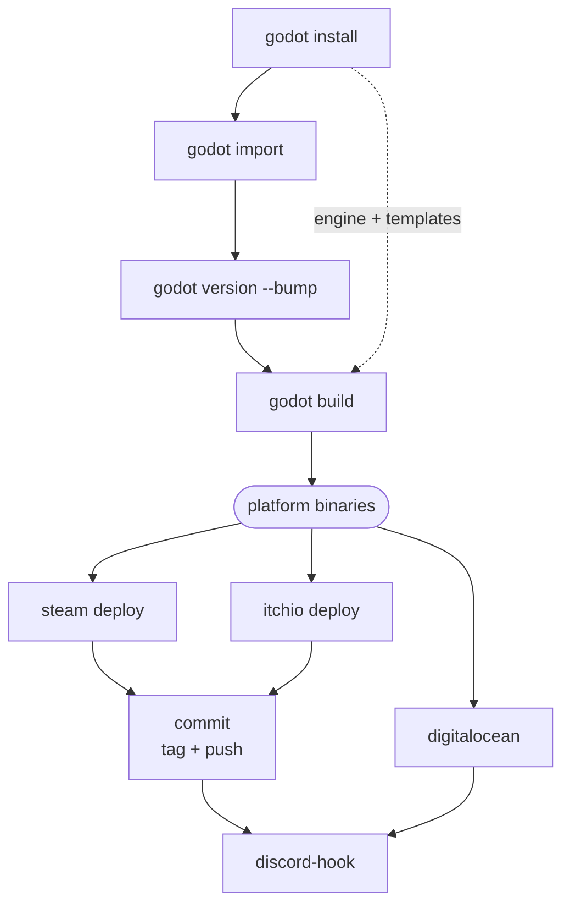

# MG-CLI

**MG-CLI** (`mg-cli`) is a [.NET 10.0 global tool](https://learn.microsoft.com/dotnet/core/tools/global-tools) that automates the end-to-end CI/CD pipeline for [Godot](https://godotengine.org/) game projects. It handles everything between "code is committed" and "players can download the new build": installing the engine, importing assets, exporting platform builds, bumping the version, tagging the release, deploying to storefronts, and announcing the release on Discord.

It is built and maintained by [Mainframe Games](https://github.com/Mainframe-Games) and published to [NuGet](https://www.nuget.org/packages/mg-cli).

```bash
dotnet tool install --global mg-cli
```

## What it does

A typical release pipeline built from `mg-cli` sub-commands looks like this:



Every command is a thin, scriptable wrapper over the tools a Godot release actually needs — the Godot headless editor, SteamCMD, itch.io's Butler, `git`, `ssh`/`scp`, and the Discord webhook API — with consistent logging, progress bars, and version handling layered on top.

## Where to go next

| If you want to… | Read |
|---|---|
| Understand what the tool is and why it exists | [Introduction](articles/introduction.md) |
| Install the tool and run your first command | [Getting Started](articles/getting-started.md) |
| Understand how the codebase is structured | [Architecture](articles/architecture.md) |
| Look up a specific command and its flags | [Command Reference](articles/commands.md) |
| Understand the shared helper layer | [Utilities](articles/utilities.md) |
| Understand versioning conventions | [Versioning](articles/versioning.md) |
| Set up automated NuGet publishing | [CI/CD Pipeline](articles/cicd.md) |
| Build, pack, and hack on the tool | [Development](articles/development.md) |

> [!NOTE]
> This documentation set is **conceptual** — it explains the design, workflows, and behavior of MG-CLI. It intentionally does **not** include generated API reference documentation. The source of truth for exact type signatures is the code itself in the [`MG-CLI/`](https://github.com/Mainframe-Games/mg-ci) project.
